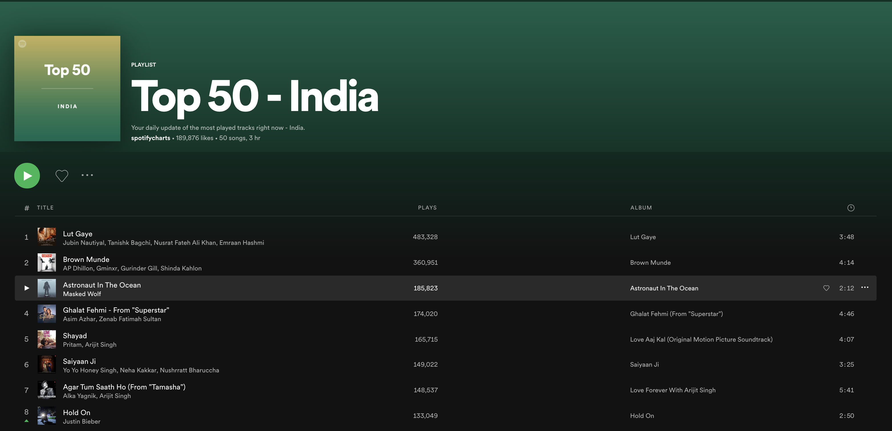

# Day 9

## Spotify: Songs

Now that you have `albums` array in `App` component which have a basic info about the albums like `album_title`, `album_cover` and `artist`, let's add more data into individual album like `songs` which is an array of object where each object represents one song which has details about song name, vide count, duration etc.

1. In `Albums` we have a list of all albums rendering like in the image below. 

On clicking on each album redirect to a route called `albums/:id` where `id` is an album id which renders a component called `Songs` component by passing the songs data in the history props using `BrowserRouter` .
`Songs` component renders a list of `Song` component where each `Song` component renders a list item which has details like song name, vide count, duration etc like shown in the picture  

2. When you refresh the page `albums/:id`,  songs props in the `Songs` component will the `undefined` since the props are not persistent. In order to avoid this use `id` from the url params and fetch the album songs from ` album` array and render it in the `Songs` component
